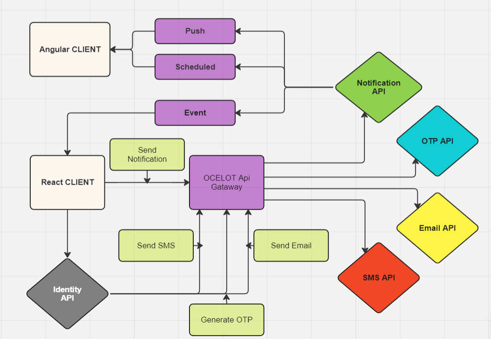

# MessagingMicroservices .NET 8

## 🏗️ Clean Architecture and Domain-Driven Desig

This project contains a suite of microservices designed for various messaging functionalities, including SMS, Email, OTP generation, and Notifications, orchestrated through an API Gateway using Ocelot. Each service is built using Clean Architecture principles and Domain-Driven Design to ensure scalability, maintainability, and adherence to business-driven models. Technologies such as Hangfire for background tasks, RabbitMQ for message brokering, SMTP for email dispatch, Twilio for SMS services, and SignalR for real-time web functionality are integrated to enhance service capabilities.
## 🛠 Configuration

To utilize the Email and SMS services, specific settings must be configured in the appsettings.json file of each respective service. These settings are currently commented out and include:

- Email Service: SMTP server details, authentication credentials.
- SMS Service: Twilio API credentials and configuration settings.
 

Uncomment and update these sections with your specific details to activate the services.

## 👀 Try it out

Ensure the .NET 8.0 SDK and [Docker Desktop](https://docs.docker.com/docker-for-windows/install/) are installed on your machine. Then execute:
```
git clone https://github.com/KristiyanEnchev/MessagingMicroservices.git
cd MessagingMicroservices/
docker-compose up --build -d
```

## 🖥 Dashboard Links

Access real-time operational data through the following dashboards:

- RabbitMQ Dashboard: http://localhost:15672 (username: john123, password: 123456)
- Hangfire Email: http://localhost:5070/hangfire (username: Admin, password: password)
- Hangfire SMS: http://localhost:5073/hangfire (username: Admin, password: password)
- Hangfire Notification: http://localhost:5071/hangfire (username: Admin, password: password)
- Redis Commander UI: http://localhost:8081 (username: masterauth, password: password)
- Redis Server Password: password

## 👷 Built with

- [.NET Core 8.0](https://github.com/dotnet/core)
- [ASP.NET Core 8.0](https://github.com/dotnet/aspnetcore)
- [ASP.NET Core WebAPI 8.0](https://github.com/dotnet/aspnetcore)
- [Entity Framework Core 8.0](https://github.com/dotnet/efcore)
- [FluentValidation](https://github.com/FluentValidation/FluentValidation)
- [AutoMapper](https://github.com/AutoMapper/AutoMapper)
- [MediatR](https://github.com/jbogard/MediatR)
- [SignalR](https://github.com/SignalR/SignalR)
- [RabbitMQ](https://github.com/rabbitmq)
- [Redis](https://github.com/redis/redis)
- [Hangfire](https://github.com/HangfireIO/Hangfire)
- [Ocelot API Gateway](https://github.com/ThreeMammals/Ocelot)
- [Twilio](https://www.twilio.com/en-us)
- [SMTP](https://developers.google.com/gmail/imap/imap-smtp)

## 📸 Flow Diagram


## ✏️ License

This project is licensed under the MIT License - see the [LICENSE](LICENSE) file for details

## 👨‍🚀 Show your support

Give a ⭐ if you like this project!

## 🧍‍♂️️ Author 

[](https://www.facebook.com/kristiqn.enchev.5/) [](https://www.instagram.com/kristiyan_e/)
[](mailto:kristiqnenchevv@gmail.com)
